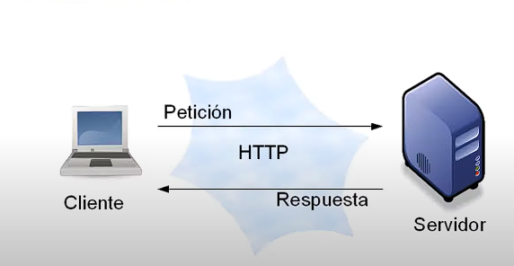
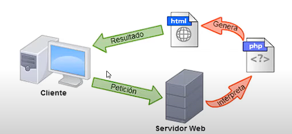

# APUNTES PHP

## ¿Que es PHP?
* PHP es un lenguaje que se utiliza para el desarrollo de aplicaciones web.
* Es facil de usar, en comparacion a otros lenguajes como Java o Ruby.
* Es multiplataforma: Se ejecuta en multitud de plataformas, sistema operativos y servidores existentes. 
* Es un lenguaje que se ejecuta de lado del servidor.
* En comun encontrar codigo PHP incrustado en paginas HTML.

### Como funciona la WEB


### Como funciona PHP


## Que es una variable:
Es el espacio de memoria que utilizamos para almacenar datos que utilizaremos de manera repetitiva en nuestra aplicacion.  
Igual que en otros lenguajes de programacion, en PHP utilizamos identificadores para definir una variable.  Ejemplo:   
```
$nota = 20
```
### Caracteristicas de las variables
* El nombre de las variables siempre debe empezar con el signo $.  
* El nombre de las variables es sensible a mayusculas y minusculas.  
* $numero <> $NUMERO
* PHP tiene un tipado debil, es decir las variables no necesitan ser declaradas antes de ser usadas.
* El nombre de las variables solo pueden llevar caracteres alfanumericos y no pueden llevar espacios.
* Podemos utilizar varios estilos de escritura. 
* Snake Case> $mi_variable  
* Upper Camel Case: $MiVariable
* Lowel Camel Case: $miVariable
* Kebab Case: $mi-variable


